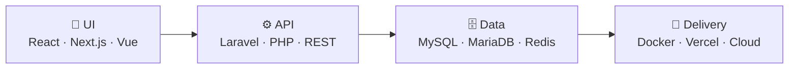

<div align="center">


<a href="https://jewelramirez.vercel.app/">
  
</a>

<br />

[](https://jewelramirez.vercel.app/)
[](https://github.com/p1llows)


</div>

---

## 🧑‍💻 About Me

<table>
<tr>
<td width="60%" valign="top">

I'm a full-stack developer who enjoys turning ideas into practical products and making existing systems better. I'm a Computer Science graduate based in **Baguio City**, and most of my time goes into web apps, backend systems, and APIs.

- 🔭 Building full-stack apps with **Laravel, React, and Next.js**
- 🗄️ Into database design, performance, and scalable architecture
- 🤖 Exploring **AI-assisted development** and AI agent workflows
- 🐳 Shipping containerized apps with Docker
- 🌱 Always learning, experimenting, and improving

</td>
<td width="40%" valign="top">

```js
const jewel = {
  role: "Full-Stack Web Developer",
  location: "Baguio City, PH 🇵🇭",
  backend: ["Laravel", "PHP", "REST"],
  frontend: ["React", "Next.js", "Vue"],
  data: ["MySQL", "MariaDB", "Redis"],
  currently: "AI-assisted dev",
  motto: "Build. Learn. Repeat.",
};
```

</td>
</tr>
</table>

---

## 🛠️ Tech Stack

<div align="center">


<br />

<br />

<br />


</div>

<details>
<summary><b>📋 See the full list with badges</b></summary>
<br />

**Languages**


**Frameworks & Libraries**


**Database & Infrastructure**


</details>

---

## 🧭 How I Build



<div align="center">


</div>

---

## 📌 Featured Projects

<table>
<tr>
<td width="50%" valign="top">

### 🧠 NL2SQLViz
**A Natural Language-to-Visualization System**
Turn plain-language questions into SQL and charts for data analysis and visualization.


</td>
<td width="50%" valign="top">

### 🤝 CSMS
**Community Service Monitoring System**
A community service management system for tracking and managing community service activities.


</td>
</tr>
<tr>
<td width="50%" valign="top">

### 🌐 [Portfolio Website](https://jewelramirez.vercel.app/)
**Showcasing my projects and skills**
My personal portfolio and the best place to see my work.


[🔗 Live site](https://jewelramirez.vercel.app/)

</td>
<td width="50%" valign="top">

### 🍰 [Dessert Diaries](https://dessert-diaries.vercel.app/)
**A recipe sharing platform**
Share recipes and connect with other food lovers.


[🔗 Live site](https://dessert-diaries.vercel.app/)

</td>
</tr>
</table>

<div align="center">

[**See all projects on my portfolio →**](https://jewelramirez.vercel.app/)

</div>

---

## 🎓 Education & Certifications

**BS Computer Science** · Don Mariano Marcos Memorial State University, South La Union Campus · *2022 – 2026*


---

## 📊 GitHub Stats

<div align="center">





<br />


</div>

---

## 💬 Words I Code By

<div align="center">


</div>

---

## 📫 Let's Connect

I'm open to collaborations, feedback, and interesting web projects.

<div align="center">

[](https://jewelramirez.vercel.app/)
[](https://github.com/p1llows)

<br />


</div>
